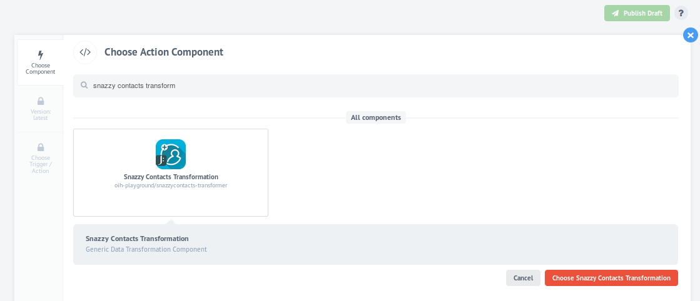
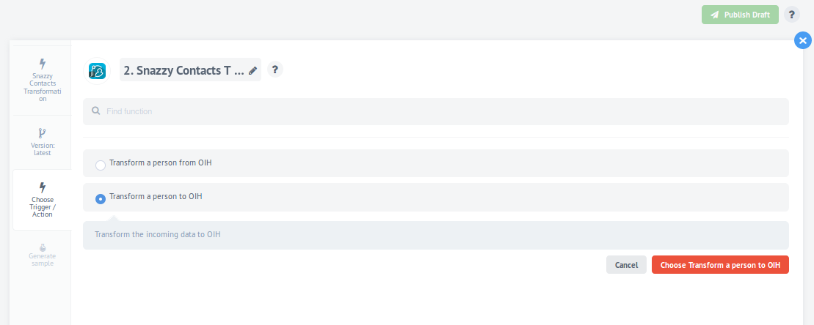
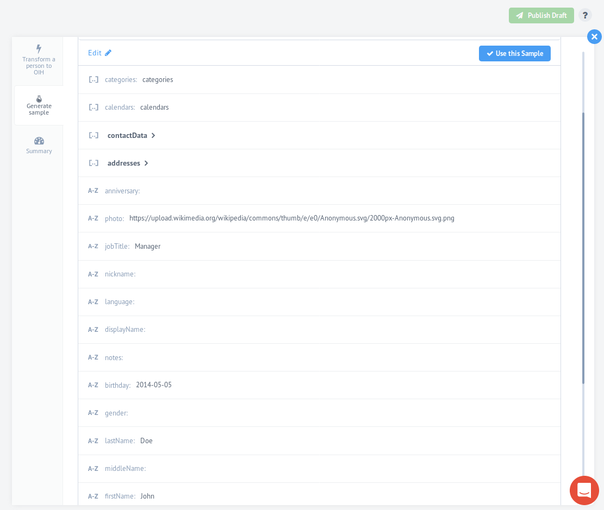

# test-jsonata-transform-component [![NPM version][npm-image]][npm-url] [![Build Status][travis-image]][travis-url] [![Dependency Status][daviddm-image]][daviddm-url]

An simple test transformer component for testing the new OIH ferryman. Modified ferryman versions can be placed and installed in the ferryman sub folder.

This component is based on the Snazzy Contacts Transformer.

## Authentication

This component requires no authentication.

## How it works

The component supports two actions - **Transform to OIH** and **Transform from OIH**. This means that the component takes the incoming message body from the previous step and creates a new expression in a ``JSON`` format. The new generated ``JSON`` object has specific properties which represent the input/output for the next/previous component in the flow.
It uses a fact that JSONata expression is a superset of JSON document so that by default any valid JSON document is a valid JSONata expression.

[Snazzy Contacts](https://snazzycontacts.com) **Transformer** on [elastic.io](http://elastic.io) graphical interface:



Both available **actions**:



The generated **sample** as a result:

  

***  

Let's see how the action **Transform from OIH** works. For example let's take this sample incoming message body and transform it to a valid [Snazzy Contacts](https://snazzycontacts.com) object:

```js
{
    firstName: msg.body.data.firstName,
    lastName: msg.body.data.lastName,
    position: msg.body.data.position,
    title: msg.body.data.title,
    jobTitle: msg.body.data.jobTitle,
    salutation: msg.body.data.salutation,
    gender: msg.body.data.gender,
    birthday: msg.body.data.birthday
}
```

The result of that transformation will be the following JSON document:

```json
{
  "firstName": "John",
  "lastName": "Doe",
  "title": "Doe",
  "jobTitle": "Manager",
  "salutation": "Mr.",
  "gender": "male",
  "birthday": "04.11.1980"
}
```

The action **Transform to OIH** works the same way. Let's take this incoming message body from [Snazzy Contacts](https://snazzycontacts.com) component:

```js
{
    firstName: msg.body.data.firstName,
    lastName: msg.body.data.lastName,
    position: msg.body.data.position,
    title: msg.body.data.title,
    jobTitle: msg.body.data.jobTitle,
    salutation: msg.body.data.salutation,
    gender: msg.body.data.gender,
    birthday: msg.body.data.birthday
}
```

The result of that transofrmation will be the following JSON document:

```json
{
  "firstName": "John",
  "lastName": "Doe",
  "title": "Doe",
  "jobTitle": "Manager",
  "salutation": "Mr.",
  "gender": "male",
  "birthday": "04.11.1980"
}
```

## License

Apache-2.0 © [elastic.io GmbH](http://elastic.io)


[npm-image]: https://badge.fury.io/js/jsonata-transform-component.svg
[npm-url]: https://npmjs.org/package/jsonata-transform-component
[travis-image]: https://travis-ci.org/elasticio/jsonata-transform-component.svg?branch=master
[travis-url]: https://travis-ci.org/elasticio/jsonata-transform-component
[daviddm-image]: https://david-dm.org/elasticio/jsonata-transform-component.svg?theme=shields.io
[daviddm-url]: https://david-dm.org/elasticio/jsonata-transform-component
